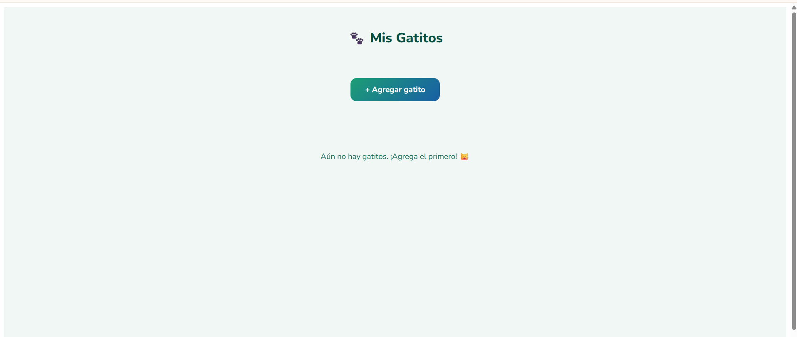
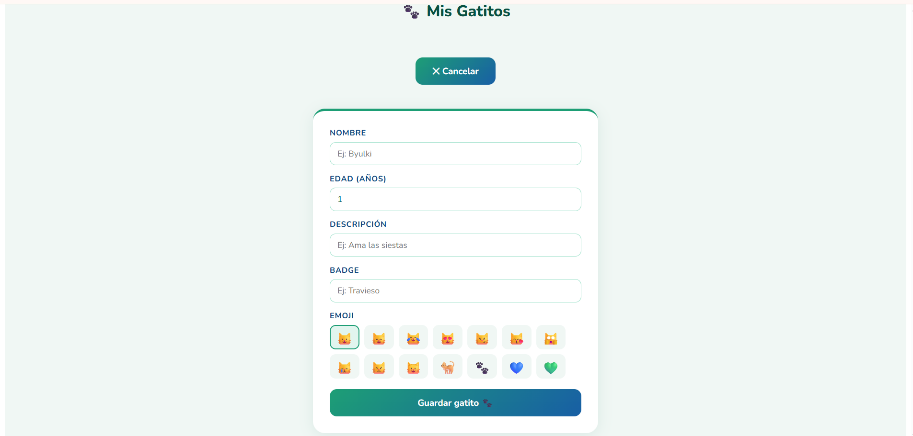
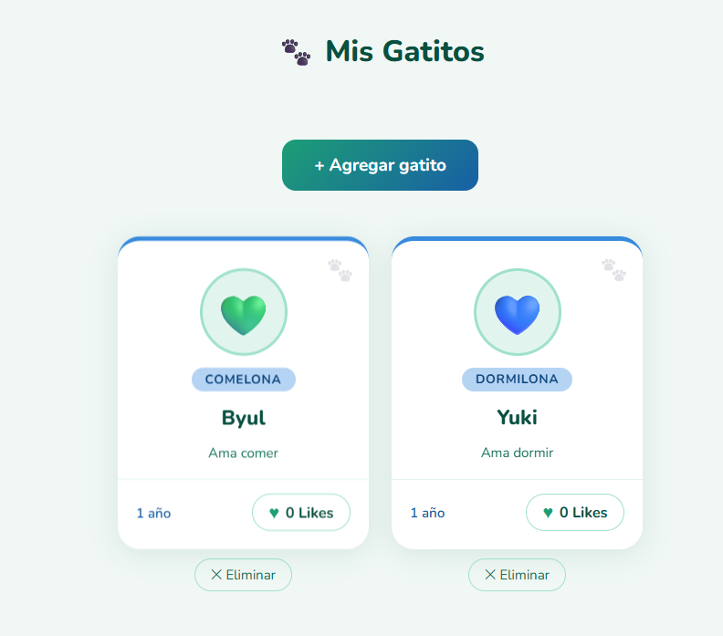
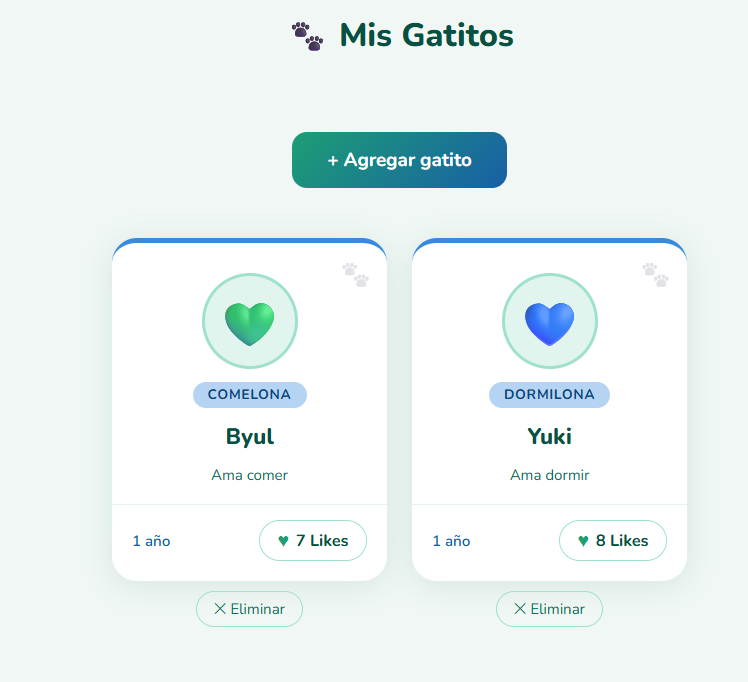

# 🐾 Mis Gatitos — Angular Component

Aplicación web construida con **Angular** como práctica de componentes, inputs, eventos y persistencia de datos.

---

## 📸 Vista previa

### Inicio

### Formulario

### Mis Gatitos

### Likes

---

## ✨ Funcionalidades

- Agregar tarjetas personalizadas con nombre, edad, descripción, emoji y etiqueta
- Dar likes a cada tarjeta de forma independiente
- Eliminar tarjetas
- Los datos y likes se guardan en **localStorage** (persisten al recargar la página)
- Formulario que aparece y se oculta con un botón
- Validación de edad (mínimo 1, máximo 20 años)

